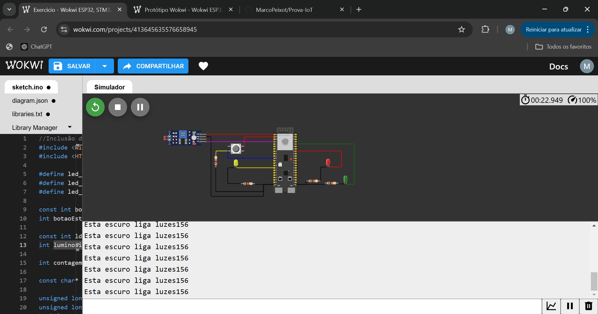

# Prova-IoT

Aluno: Marco Ruas Sales Peixoto

## Estados

### Modo noturno
Esse modo é ativado quando o sensor ldr lê o valor analógico abaixo de 600. O modo pisca o led amarelo por 1 segundo, utilizando `delay` por 500 ligado e 500 desligado.

A imagem abaixo mostra o funcionamento do led amarelo apagando no modo noturno.


A imagem abaixo mostra o funcionamento do led amarelo ligando no modo noturno.


---

### Modo Convencional/Semáforo
Esse modo é ativado quando o sensor ldr lê o valor acima de 600. O modo chama a função `void modoConvencional();` onde liga o led verde por 3 segundos utilizando `delay`, após apaga e liga o amarelo por 2 segundos e após isso apaga o amarelo e liga o vermelho. Após isso volta em loop.


### Apertando botão
Esse estado é ativado quando o sensor lê acima de 600, quando a váriavel `const char* estado` for `estado=="F"` e quando o botão for pressionado 1 vez, a variável `estado` muda para `estado=="F"` quando o led vermelho fica acesso. Após clicar o botão e o led estiver vermelho, ele chama a função `void modoConvencional();` novamente e reinicia o ciclo, abrindo o semáforo.


### Apertando o botão 3 vezes
Esse estado é ativado quando o sensor lê acima de 600, quando a váriavel `const char* estado` for `estado=="F"` e quando o botão for pressionado 3 vez. Ele chama a função `void enviarRequisicao();` e espera o retorno:


Se estiver com conexão ao WIFI:

```
HTTP codigo de resposta: 200
Alerta enviado!!
```

Se não estiver com conexão ao WIFI:

```
Envio requisição!
WiFi Desconectado
Alerta enviado!! (Offline)
```


### Exigências 


#### 1) Todo o código deve estar padronizado para inglês ou português, incluindo comentários (1,0 ponto);

Realizado, código está em só em português, exceto funções do próprio arduino e está comentado. Como mostrado aqui [Código](/sketch.ino).

#### 2) Todas as entradas e saídas devem estar declaradas corretamente na inicialização (1,0 ponto);

Tudo é declado no topo e inicializado corretamente no `void setuo()` como mostrado abaixo:

```cpp
void setup() {

  // Configuração inicial dos pinos para controle dos leds como OUTPUTs (saídas) do ESP32
  pinMode(led_verde, OUTPUT);
  pinMode(led_vermelho, OUTPUT);
  pinMode(led_amarelo, OUTPUT);

  // Inicialização das entradas
  pinMode(botaoPino, INPUT); // Configura o pino do botão como INPUT (Entrada)

  // Inicializa todos os LEDS como LOW, ou seja, desligado.
  digitalWrite(led_verde, LOW);
  digitalWrite(led_vermelho, LOW);
  digitalWrite(led_amarelo, LOW);

  Serial.begin(115200); // Configuração para debug por interface serial entre ESP e computador com baud rate de 115200.

  setupWifi(); // Inicializa a conexão com o wifi
}

```

#### 3) Todos os leds devem estar apagados na inicialização (até 1,0 ponto);

Todos os leds são inicializados desligados.

```cpp
void setup() {
  // Inicializa todos os LEDS como LOW, ou seja, desligado.
  digitalWrite(led_verde, LOW);
  digitalWrite(led_vermelho, LOW);
  digitalWrite(led_amarelo, LOW);
}

```

#### 4) Quando estiver escuro (segundo a leitura analógica do sensor LDR), o protótipo deve ativar o modo noturno e piscar o led amarelo a cada segundo (até 1,0 ponto);

Realizado. A função é feita dentro do `void loop()` e é criado outra função `void modoNoturno()`:

```cpp
//Condição dentro do void loop
if (ldrstatus <= luminosidade) {
    Serial.print("Esta escuro liga luzes");
    Serial.println(ldrstatus);
    modoNoturno();

  }
```

```cpp
// modo que pisca o led amarelo
void modoNoturno() {
  digitalWrite(led_verde, LOW);
  digitalWrite(led_vermelho, LOW);
  digitalWrite(led_amarelo, LOW);
  digitalWrite(led_amarelo, HIGH);
  delay(500);
  digitalWrite(led_amarelo, LOW);
  delay(500);
}
```

#### 5) Quando estiver claro (segundo a leitura analógica do sensor LDR), o protótipo deve ativar o modo convencional e fazer a temporização alternando entre verde (3 segundos), amarelo (2 segundos) e vermelho (5 segundos) (até 2,0 pontos);

Realizado. É feito com a função abaixo:


```cpp
// modo que liga o semáforo
void modoConvencional() {
  digitalWrite(led_vermelho, LOW);
  digitalWrite(led_verde, HIGH);
  estado = "A"; // estado do semaforo está aberto
  delay(3000);
  digitalWrite(led_verde, LOW);
  digitalWrite(led_amarelo, HIGH);
  estado = "E"; // estado do semaforo está no modo espera
  delay(2000);
  digitalWrite(led_amarelo, LOW);
  digitalWrite(led_vermelho, HIGH);
  estado = "F"; //estado do semaforo esté no modo fechado
  delay(5000);
}
```

E chamado dentro dessa condicional no `void loop()`:

```cpp
else if (ldrstatus >= luminosidade && *estado == 'A') {
    Serial.print("Esta claro desliga luzes");
    Serial.println(ldrstatus);
    modoConvencional();
  }
```

#### 6) Quando estiver claro (segundo a leitura analógica do sensor LDR) e o semáforo estiver no estado fechado (somente led vermelho aceso) e o botão for pressionado, o semáforo deve abrir 1 segundo após o pressionamento do botão (até 2,0 pontos);

Realizado. É chamado dentro dessa condicional:

```cpp

else if (ldrstatus >= luminosidade && *estado == 'F') {


    // Verifica se o botão mudou de estado (para debounce)
    if (leitura != ultimoEstadoBotao) {
      ultimoBounce = millis(); // Atualiza o tempo de debounce
    }

    // Verifica se o tempo de debounce passou
    if ((millis() - ultimoBounce) > debouceTempo) {
      // Se o estado do botão mudou
      if (leitura != botaoEstado) {
        botaoEstado = leitura;

        // Verifica se o botão está pressionado
        if (botaoEstado == HIGH) { // Se o estado for 1, botão foi pressionado
          contagem += 1;
          Serial.println(contagem);

          if (contagem == 1) {
            //volta para o semaforo normal
            modoConvencional();
            estado = "A";
          }

          if (contagem == 3) {
            Serial.println("Envio requisição!");
            enviaRequisicao();
            estado = "A";
          }
        } else { // Se não, botão não foi pressionado
          Serial.println("Botão não pressionado!");
          estado = "A";
        }
      }
    }


  }

```

#### 7) O protótipo deve suportar debounce na leitura do botão (até 1,0 ponto);
Realizado. Uma das exigências é o uso do debounce, onde foi utilizando no dentro do `void loop`, como mostra abaixo:

``` cpp

    // Verifica se o botão mudou de estado (para debounce)
    if (leitura != ultimoEstadoBotao) {
      ultimoBounce = millis(); // Atualiza o tempo de debounce
    }

    // Verifica se o tempo de debounce passou
    if ((millis() - ultimoBounce) > debouceTempo) {
      // Se o estado do botão mudou
      if (leitura != botaoEstado) {
        botaoEstado = leitura;

        // Verifica se o botão está pressionado
        if (botaoEstado == HIGH) { // Se o estado for 1, botão foi pressionado
          contagem += 1;
          Serial.println(contagem);

          if (contagem == 1) {
            //volta para o semaforo normal
            modoConvencional();
          }

          if (contagem == 3) {
            Serial.println("Envio requisição!");
            enviaRequisicao();
          }
        } else { // Se não, botão não foi pressionado
          Serial.println("Botão não pressionado!");
          estado = "A";
        }
      }
    }


  }

  

  // Salva o estado atual do botão como o estado anterior
  ultimoEstadoBotao = leitura;
}
```


#### 8) Quando estiver claro (segundo a leitura analógica do sensor LDR) e o semáforo estiver no estado fechado (somente led vermelho aceso) e o botão for pressionado 3 vezes, você deve enviar uma requisição HTTP para implementar um alerta (realize uma requisição para o http://www.google.com.br/ para fins de teste) (até 1,0 ponto).

Realizado. É feito dentro desse condicional:

```cpp
 if (contagem == 3) {
            Serial.println("Envio requisição!");
            enviaRequisicao();
            estado = "A";
          }
```

Que chama essa função abaixo:

```cpp
// função para enviar a requisição
void enviaRequisicao() {
  if (WiFi.status() == WL_CONNECTED) { // Se o ESP32 estiver conectado à Internet
    HTTPClient http;

    String serverPath = "http://www.google.com.br/"; // Endpoint da requisição HTTP

    http.begin(serverPath.c_str()); // Inicializa o HTTP

    int httpResponseCode = http.GET(); // Código do Resultado da Requisição HTTP

    if (httpResponseCode > 0) {
      Serial.print("HTTP codigo de resposta: ");
      Serial.println(httpResponseCode);
      String payload = http.getString();
      Serial.println(payload);
      Serial.println("Alerta enviado!!");
    }
    else {
      Serial.print("Codigo do erro: ");
      Serial.println(httpResponseCode);
    }
    http.end();
  }

  else {
    Serial.println("WiFi Desconectado");
    Serial.println("Alerta enviado!! (Offline)");
  }
}
```